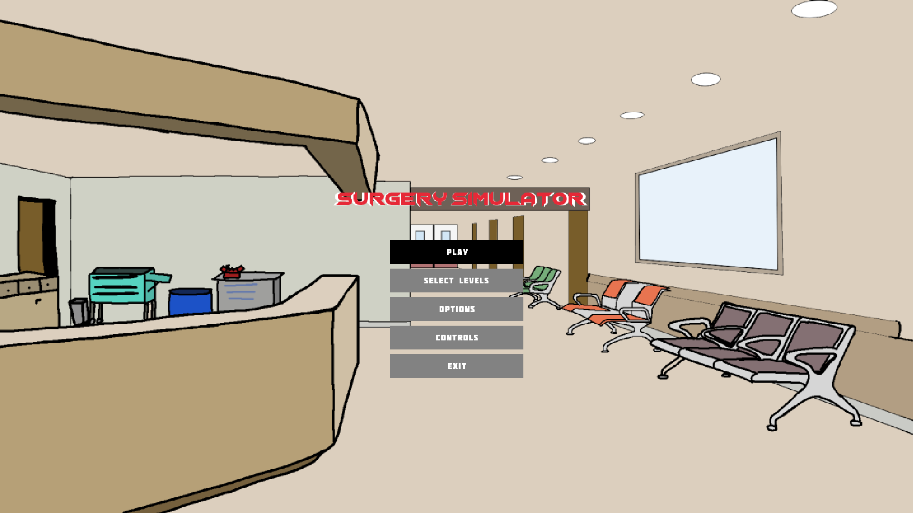

 
 

 
 
 

 

# Hello, we are team The Boys 👋

We want to show you our game related to biology

---

# Contributors

Denis Kolev - Scrum Trainer
 
Bozhidar Boyadzhiev - Backend developer
 
Mario Zlatev - Backend developer
 
Georgi Zhekov - Backend developer
 
Kliment Tenev - Designer
 

---

# Preview of the game 

<b>Our game contains a menu, from which the user can choose between three levels where he can operate on three different characters. After each operation the user can move on to the next level and eventually finish the game</b>

---

# Used technologies and tools
 <h3> Teams - Communication </h3>
 <h3> VS Code - Code Editor</h3>
 <h3> MS Word - Documentation</h3>
 <h3> MS PowerPoint - Presentation</h3>
 <h3> MS Excel - QA Documentation</h3>
 <h3> C++ - Programming Language</h3>
 <h3> Raylib -  Programming Library</h3>
 <h3> JSON -  Programming Library</h3>

---
# 📥Installation

To download our project clone our repository, writing git clone and then pasting this text in your command prompt:

<pre>https://github.com/DNKolev20/The-Boys.git</pre>